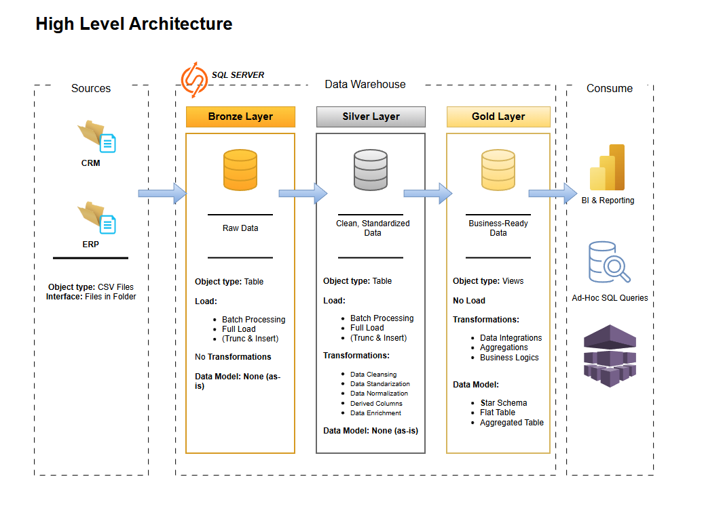
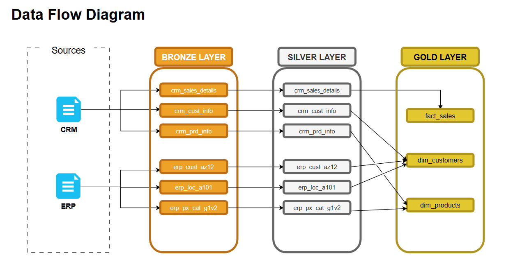
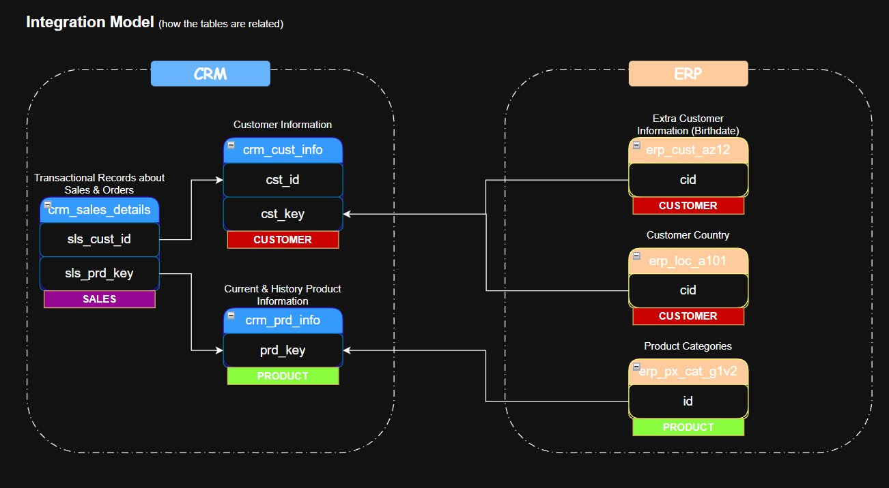
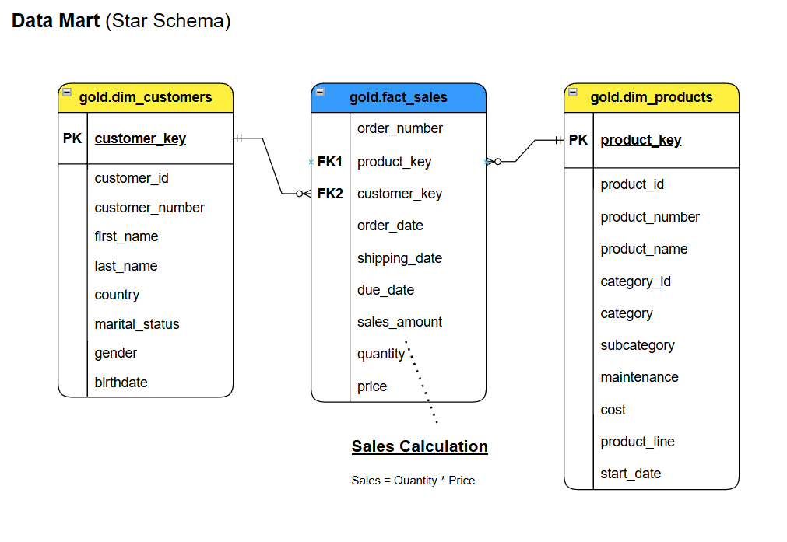

# Enterprise Data Warehouse: Medallion Architecture

## 📌 Project Overview
This project demonstrates the end-to-end engineering of a robust Data Warehouse utilizing Microsoft SQL Server. The primary objective was to extract, transform, and load (ETL) disparate datasets from a CRM and an ERP system, integrating them into a governed, business-ready Star Schema. 

The pipeline strictly adheres to the **Medallion Architecture** (Bronze, Silver, Gold), ensuring data traceability, quality, and analytical efficiency.

## 🛠️ Technology Stack
* **Database Engine:** Microsoft SQL Server
* **Language:** T-SQL (Transact-SQL)
* **Architecture Pattern:** Medallion Architecture, Star Schema
* **Concepts:** Data Integration, ETL Automation, Defensive Programming, Master Data Management (MDM), Surrogate Keys, SCD Type 2.

---

## 🏗️ Architecture & Data Flow

### 🥉 Bronze Layer (Raw Ingestion)
The Bronze layer acts as the initial landing zone for raw data extracts (CSV files). 
* **Execution:** Automated via `BULK INSERT` statements.
* **Data Types:** All columns are ingested as `NVARCHAR` to prevent upstream data type anomalies from crashing the ingestion process.
* **Goal:** Create a fast, exact replica of source systems with zero transformations.

### 🥈 Silver Layer (Cleansing & Integration)
The Silver layer is the transformation hub. Here, data is standardized, cleansed, and integrated across the CRM and ERP systems.
* **Defensive Engineering:** Heavy utilization of `TRY_CAST` to gracefully handle bad data without pipeline failure.
* **Deduplication:** Window functions (`ROW_NUMBER()`) implemented to extract the most recent, active records.
* **Data Quality Checks:** Engineered self-healing arithmetic validations (e.g., `NULLIF`, `ABS`) to automatically recalculate missing or anomalous financial metrics.
* **Normalization:** Applied `TRIM()`, `SUBSTRING()`, and strict `CASE` statements to standardize geospatial data and categorize business logic.

### 🥇 Gold Layer (Business & Reporting)
The Gold layer serves as the Semantic Layer, optimized entirely for Business Intelligence (BI) and ad-hoc reporting.
* **Virtualization:** Constructed entirely using SQL `VIEW`s to optimize storage overhead while ensuring zero-latency access to the most recent Silver-layer transformations.
* **Star Schema:** Fact and Dimension tables architected for intuitive querying.
* **Surrogate Keys:** Generated independent `customer_key` and `product_key` identifiers to insulate downstream reporting from source-system volatility.
* **Slowly Changing Dimensions (SCD):** Applied SCD Type 2 current-state filtering to isolate active records and prevent duplicate aggregations.

---

## 🚀 Key Engineering Highlights
1.  **Idempotent Pipelines:** Stored procedures are designed to be rerun safely without duplicating data, utilizing `TRUNCATE` and `INSERT` methodologies.
2.  **Cross-System Survivorship:** Engineered complex `COALESCE` and `CASE` logic to resolve data conflicts between the CRM and ERP, establishing a Single Source of Truth for customer demographics.
3.  **Automated Logging:** Built-in dynamic execution logging capturing batch start times, end times, and load durations.
4.  **Error Handling:** Enterprise-grade `TRY...CATCH` blocks implemented to trap, log, and report SQL errors during the ETL process.

## 📂 Repository Structure
* `src/bronze/`: DDL and `BULK INSERT` scripts for raw data.
* `src/silver/`: Cleansing transformations and Data Quality Stored Procedures.
* `src/gold/`: View definitions for the Star Schema (Dimensions and Facts).
* `tests/`: SQL scripts for Referential Integrity and Foreign Key testing.
* `assets/`: Architectural diagrams and schema maps.
